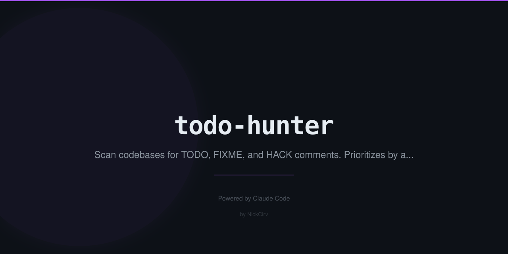

# todo-hunter

Hunt down every TODO, FIXME, HACK, and XXX in your codebase — with priorities, categories, and git blame.

<p align="center">
  
  = 18" />
  
</p>

## Why

Every codebase has a graveyard of TODO comments. Most tools just list them. `todo-hunter` goes further: it categorizes each comment (bug vs tech-debt vs feature vs optimization), assigns a priority (P1–P4), runs `git blame` to show who wrote it and how long ago, and surfaces orphaned items from authors who no longer contribute. Now you can actually triage the list.

## Quick Start

```bash
# Scan current directory
npx todo-hunter scan

# Scan a specific path
npx todo-hunter scan ./src

# Stats dashboard
npx todo-hunter stats

# Prioritized report, filter by level
npx todo-hunter report --priority P1

# Who wrote all these TODOs?
npx todo-hunter blame --ancient
```

## What It Does

- Scans JS, TS, JSX, TSX, Python, Go, Ruby, Java, PHP, C#, C++, C, Rust, Swift, Kotlin — and more
- Detects keywords: `TODO`, `FIXME`, `BUG`, `HACK`, `XXX`, `REFACTOR`, `OPTIMIZE`, `PERF`, `NOTE`
- Auto-categorizes: `bug` | `tech-debt` | `optimization` | `feature` | `question` | `note`
- Priority matrix: `P1` (FIXME/BUG) → `P2` (HACK/XXX/REFACTOR/OPTIMIZE) → `P3` (TODO) → `P4` (NOTE)
- 2-line context shown around each match for quick understanding
- Git blame integration: author, age in days, orphaned status
- Output formats: table (default), JSON, CSV
- Skips `node_modules`, `.git`, `dist`, `build`, `coverage`, `__pycache__`, and more

## Example Output

```
$ npx todo-hunter scan ./src

Scanning ./src...

  src/auth/session.ts:142
  [P1] [bug] FIXME: token refresh fails silently when refresh_token is expired
  Author: alice@example.com  ·  34 days ago

  src/payments/stripe.js:89
  [P2] [tech-debt] HACK: retry logic bypasses the queue — causes duplicate charges on timeout
  Author: bob@example.com  ·  180 days ago  ·  ⚠ orphaned

  src/api/users.ts:203
  [P3] [feature] TODO: add pagination support for /users endpoint
  Author: carol@example.com  ·  12 days ago

  Found 47 items  ·  3 P1  ·  12 P2  ·  28 P3  ·  4 P4
```

## Commands

### `scan [dir]`

Scan for all TODO-style comments and display results.

| Option | Description | Default |
|--------|-------------|---------|
| `-e, --ext <extensions>` | Comma-separated file extensions | `js,ts,jsx,tsx,py,go,rb,java,php,cs,cpp,c,rs,swift,kt` |
| `--no-blame` | Skip git blame (faster) | blame enabled |
| `-o, --output <format>` | Output format: `table`, `json`, `csv` | `table` |

### `stats [dir]`

Dashboard showing category and priority breakdown.

### `report [dir]`

Detailed prioritized report with filtering.

| Option | Description |
|--------|-------------|
| `-p, --priority <level>` | Filter by priority: `P1`, `P2`, `P3`, `P4` |
| `-t, --type <type>` | Filter by type: `bug`, `tech-debt`, `feature`, `optimization`, `question` |

### `blame [dir]`

Show authorship, age, and orphaned items.

| Option | Description |
|--------|-------------|
| `--ancient` | Show only TODOs older than 90 days |
| `--orphaned` | Show only TODOs from authors no longer active |

## Install Globally

```bash
npm i -g todo-hunter
```

## License

MIT
