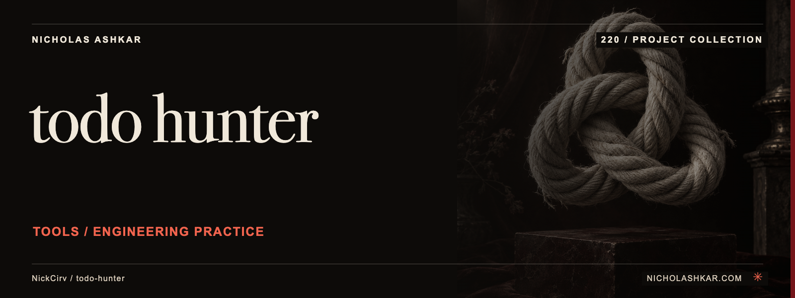

# todo-hunter

Inventory TODO-style comments and organize them into a reviewable technical-debt report.

Scans supported extensions, assigns local keyword-based type/priority labels and optionally enriches comments with Git author/age information.


<a id="install"></a>

## Quickstart

Package runtime requirement: Node.js `>=20`. Git is needed to obtain this pinned source checkout.

```bash
git clone https://github.com/NickCirv/todo-hunter.git
cd todo-hunter
git checkout ab90c08ff9bd781e386ad3c37171fd973d086fb2
npm install --ignore-scripts
node bin/hunt.js scan . --no-blame --output json
```

This source-derived example has not been executed in this review. The command prints recognized comments without Git blame queries. Empty output does not establish the absence of unfinished work.


<a id="commands"></a>

<a id="scan-dir"></a>

<a id="stats-dir"></a>

<a id="report-dir"></a>

<a id="blame-dir"></a>

<a id="what-it-detects"></a>

## Usage

```bash
node bin/hunt.js stats ./src
node bin/hunt.js report ./src --priority P1
node bin/hunt.js blame ./src --ancient
```

`scan --output` accepts table/json/csv. `--ext` chooses extensions. `--orphaned` uses the tool’s recent-author heuristic.

[Command reference](docs/REFERENCE.md) covers arguments, modes and output controls.


<a id="what-it-is-not"></a>

## Behavior and limits

Despite the package description’s AI wording, the inspected commands scan, classify and report; they do not use an AI service to resolve TODOs. Priority/type labels are rules, not owner-confirmed urgency. A contributor absent from a 90-day log is not proof that a task is unowned.

## Development

Declared package scripts:

| Script | Command |
| --- | --- |
| `start` | `node bin/hunt.js` |
| `lint` | `node --check src/*.js bin/hunt.js` |
| `test` | `node --test` |

The smoke test syntax-checks the entrypoint; it does not exercise CLI behavior or integrations.

## Research

[Source review and claim ledger](docs/RESEARCH.md) records revision `ab90c08ff9bd`, inspected files and verification gaps.

## License and attribution

Protected license and attribution files remain unchanged: [LICENSE](https://github.com/NickCirv/todo-hunter/blob/ab90c08ff9bd781e386ad3c37171fd973d086fb2/LICENSE).

[Artwork credits](assets/nicholas-ashkar/CREDITS.md) · [Nicholas Ashkar — consulting](https://nicholashkar.com/#oxblood-contact)
