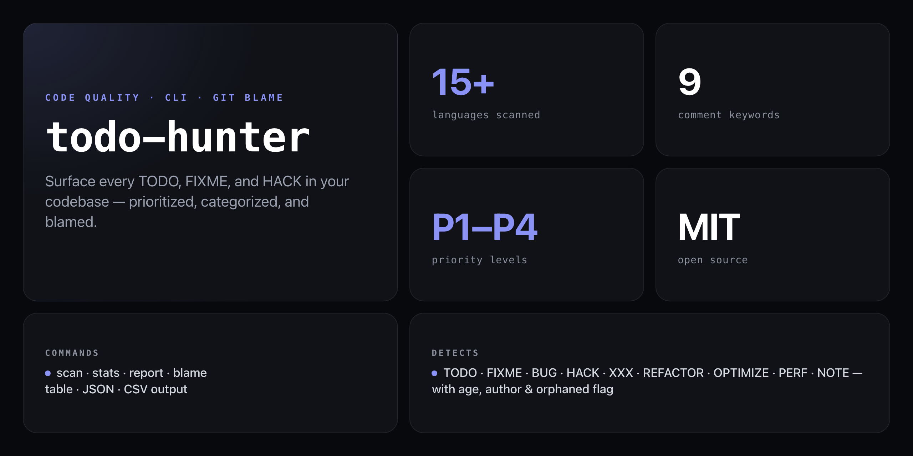

<div align="center">

**Hunt down every TODO, FIXME, and HACK in your codebase — with priority triage, git blame, and orphaned-author detection.**


</div>

---

Most tools just list TODOs. `todo-hunter` goes further: it auto-categorizes each comment (`bug` / `tech-debt` / `feature` / `optimization`), assigns a priority (P1–P4), runs `git blame` to surface who wrote it and how long ago, and flags items from authors who no longer contribute. Now you can actually triage the list instead of ignoring it.

```
$ npx github:NickCirv/todo-hunter scan ./src

Scanning ./src...

  src/auth/session.ts:142
  [P1] [bug] FIXME: token refresh fails silently when refresh_token is expired
  Author: alice@example.com  ·  34 days ago

  src/payments/stripe.js:89
  [P2] [tech-debt] HACK: retry logic bypasses the queue — causes duplicate charges on timeout
  Author: bob@example.com  ·  180 days ago  ·  ⚠ orphaned

  src/api/users.ts:203
  [P3] [feature] TODO: add pagination support for /users endpoint
  Author: carol@example.com  ·  12 days ago

  Found 47 items  ·  3 P1  ·  12 P2  ·  28 P3  ·  4 P4
```

## Install

No npm account needed — runs straight from GitHub:

```bash
npx github:NickCirv/todo-hunter scan
```

## Usage

```bash
# Scan current directory
npx github:NickCirv/todo-hunter scan

# Scan a specific path
npx github:NickCirv/todo-hunter scan ./src

# Stats dashboard — category and priority breakdown
npx github:NickCirv/todo-hunter stats

# Prioritized report, filter by level
npx github:NickCirv/todo-hunter report --priority P1

# Filter by type
npx github:NickCirv/todo-hunter report --type bug

# Who wrote all these TODOs? Show ancient and orphaned items
npx github:NickCirv/todo-hunter blame --ancient
```

## Commands

### `scan [dir]`

Scan for all TODO-style comments and display results.

| Option | Description | Default |
|--------|-------------|---------|
| `-e, --ext <extensions>` | Comma-separated file extensions | `js,ts,jsx,tsx,py,go,rb,java,php,cs,cpp,c,rs,swift,kt` |
| `--no-blame` | Skip git blame (faster) | blame enabled |
| `-o, --output <format>` | Output format: `table`, `json`, `csv` | `table` |

### `stats [dir]`

Dashboard showing category and priority breakdown across the whole codebase.

### `report [dir]`

Detailed prioritized report with filtering.

| Option | Description |
|--------|-------------|
| `-p, --priority <level>` | Filter by priority: `P1`, `P2`, `P3`, `P4` |
| `-t, --type <type>` | Filter by type: `bug`, `tech-debt`, `feature`, `optimization`, `question` |

### `blame [dir]`

Show authorship, age, and orphaned items.

| Option | Description |
|--------|-------------|
| `--ancient` | Show only TODOs older than 90 days |
| `--orphaned` | Show only TODOs from authors no longer active |

## What it detects

| Keyword | Priority | Category |
|---------|----------|----------|
| `FIXME`, `BUG` | P1 | bug |
| `HACK`, `XXX`, `REFACTOR`, `OPTIMIZE` | P2 | tech-debt / optimization |
| `TODO` | P3 | feature / general |
| `PERF` | P2 | optimization |
| `NOTE` | P4 | note |

Scans JS, TS, JSX, TSX, Python, Go, Ruby, Java, PHP, C#, C++, C, Rust, Swift, Kotlin — and more. Skips `node_modules`, `.git`, `dist`, `build`, `coverage`, `__pycache__` automatically. Shows 2 lines of context around each match.

## What it is NOT

- **Not a linter or static analysis tool.** It surfaces comment markers only — it doesn't analyze runtime behavior or code correctness.
- **Not a task manager.** It reads comments from source files; it doesn't write back, close tickets, or sync with Jira/GitHub Issues.
- **Not a guarantee of completeness.** Detection is keyword-based: custom markers or non-standard spellings won't be caught unless they match the known keyword set.

---

<div align="center">
<sub>Node 18+ · MIT · by <a href="https://github.com/NickCirv">NickCirv</a></sub>
</div>
